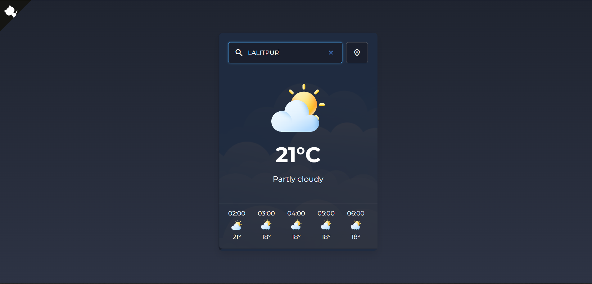

# 🌤 Weather App

A simple and responsive weather application built with **React** (Vite) that fetches real-time weather data from an external Weather API.  
Enter a city name and instantly see the current temperature, weather condition, humidity, and more — beautifully displayed.

---

## 🚀 Features

- 🔍 _Search weather by city_
- 📍 _Detects your current location_
- 🌡 _Displays temperature in °C / °F_
- ⏱ _Real-time updates_
- 📱 _Fully responsive design_

---

## 🛠 Tech Stack


---

## 📷 Preview



---

## 📦 Installation & Setup

1. **Clone the repository**
   ```bash
   git clone https://github.com/your-username/weather-app.git
   cd weather-app
   ```
2. **Install dependencies**
   ```bash
   npm install
   ```
3. **Add your API Key**
   - Create a `.env` file in the root directory
   - Add your API key:
   ```bash
   VITE_WEATHER_API_KEY=your_api_key_here
   ```
4. **Run the development server**
   ```bash
   npm run dev
   ```

**⭐ If you like this project, give it a star, helps me a lot!**
